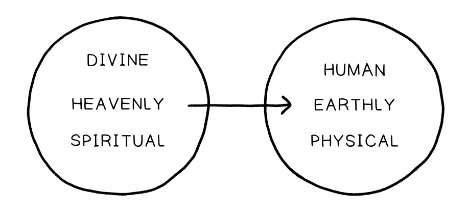

# Material
[Intro to the Hebrew Bible: Lecture 7](https://bibleproject.com/classroom/introduction-to-the-hebrew-bible/sessions/7)

# The Nature of the Bible Inspiration

## Origins of the Premise

A very common attribution to the Scriptures that the church holds to is the premise of inspiration. Inspiration is *a claim about the nature of the biblical texts*. The meaning of this claim has had ongoing life in the history of the church and different traditions in different contexts and times have had varying understanings of what this means. It's important to recognize that any understanding about the nature of the scriptures, especially as it pertains to their being "God-breathed", is going to shape our expectation of what these texts are, how they communicate, their purpose, and their role in our lives. All to often the meaning of the claim that scripture is God-breathed is assumed without thoughtful reflection on the origins of the phrase. This can give us presumed expectations about the scriptures that create more problems than they help us navigate. 

The premise of scripture as God-breathed emerges from 2 Timothy 3:16:

> But you must continue in the things which you have learned and been assured of, knowing from whom you have learned them, and that from childhood you have known the Holy Scriptures, which are able to make you wise for salvation through faith which is in Christ Jesus. All Scripture is given by inspiration of God (theopneustos), and is profitable for doctrine, for reproof, for correction, for instruction in righteousness, that the man of God may be complete, thoroughly equipped for every good work.
> 2 Tim. 3:16 (NKJV)

Theopneustos is Paul's word that acts as a *type of meta-reflection on the nature of the scriptures*. The underlying word is compound word that translates to the "breath of God". Theopneustos is only used once in the entirety of the new testament in this passage by Paul. For Paul, theopneustos is form of *theological shorthand that is packed with meaning and backstory*. If we want to engage with an understanding of what Paul means by this word it's important that we engage with his understanding God's divine breath at work in the world.

## Models of Inspirations

As we mentioned at the outset, there are and have been different models for understanding the process of inspiration. This process by which humans, under the guidance of God's spirit craft a text that speaks what God wants his people to hear[^1].

[^1]: I think Tim inserts too much into the definition of inspiration here. This definition gets close to assuming that the scriptures are God's way of communicating timeless truth to his people. Perhaps it would be better to say that the Spirit guides people to reveal significance about God incarnate in the context of their time, culture, and language.

To one extreme there is a common view, which hopefully not framed too pejoartively, can be called the Golden Tablets from Heaven View. And this view assumes, that *in order for the scriptures to speak a divine word (i.e. to speak in a divine capacity) it needs to have bypassed human involvement*. The conception of this view tends to be of a bibical author falling under the power of Spirit which works through them to produce the text in a way that independent of the personality, experiences, character, tics, and faculties of that individual. If we look closely though at how the biblical author's themselve portay their experience of working in partnership with God's spirit (as we will) see see that this isn't the case. 

It's important to note that this point is not made to bash a certain view of inspiration. But to face that view, refelct on it, and the implication that it has, and importanrly the background that informs this view. This was largely the bpersepctive of the scriptures in the community in which I came to faith myself and so I have an appreciation that this view aims to uphold view of the scripture that they believe preserves God's involvement and the integrity of divine authorship. However, if you hold that expectation, it's important to ask the question whether that expection is one which the bible holds for itself. 

The reality of the 

- the process of the bible coming together is very complex. Their is history of interactions with changes to the manuscript that is incredibly human
- When people are under the spirit they are in control of themselves

The challenge over time as you come an understanding of the making of the bible leads to an understanding of a cannon that is shaped over time.

Let's look at moments when the authors mention their own biblcal writing and what we'll notice is that it's mundace/normal. IT should n't frighten us but encourage us to challenge our assumptions

## Biblical Representations of Inspiration

The Scriptures that Paul refers to in 1 Timothy 3:16 are the Jewish Scriptures, what now refer to as our old testament. These scriptures are full of places where the authors themselves write about the experience of having God's spirit at work in them. 

Examples of people understanding themselves under th influence of God's spirit but with control of their facultires (beautiful poetic form and narrtive form)
Micah 3:8
2 Samuel 23:1-2

### Unpacking the Assumptions of our Cultural Moment

One our first big challenges that we must face when we come to the scriptures is due that fact that, for us , in hte west we are 2 centuries into a modern secular tradition that sees a firm spearation between the divine and the human, the heavenly and earthly, the spiritual, and the physical. For the most part, if some one beleives that hte divine exists, the cultural assumption is that it is a realm that is separate and isolated freom our daily physical realm. However, sometimes God and the heavenly realm will invade/intervene our natural world and we call it miracles/supernatural. The deep assumption, going back to philospgers from centruires ago is that God insturments that physical world and then retreats to his own realm with occasional intervention. Now, 200 years later people don't have an experience of the divine and so they question at all whether this realm even exists.

The problems is, this model is only around 200 years old. Before then, the natrual and supernatural were not considered distinct but were deeply intertwined. God pushed the sun up every morning and that was natural. It was an enchanted view of the world not bounded by what we could see and test. The problem we often have now, is that we plug the bible into this modern model and create all kinds of problems for ourselves. Problems that relate to understanding what it is and how it speaks, and our expectations for it. Practically, what happnes is that we want to uphold a high view of scripture as we feel forced to defend it as one of these supernatural interventions and so then it becomes important to defend and explain that it came into existence through supernatural means that cannot be explained through normal human processes, because if that's what happned then the bible is simply a natrual document.

### Re-shaping our Notion of Divine-Human Partnership

Now, do the biblical authors share this view of reality? This view of the relationship between the heavenly and the earthly.

From page one of the bible, we are presented with a view that believes in multiple domensions to reality, of the heavenly and earthly. 

The whole nature of the garden of eden and the image of God is that humans are the place heavenly and the earthly, the dvine and the human are one. Rhe entrie image of Eden, in which God walks with humanity and humanity is atuned to the sound of God's presence speaks to the vision of creation as a unified heaven and earth 

Gen 1:26
God's will is carried forward in and through humans who he has chosen to partner with in bringing blessing to creation. God's interventions is through the natrual. He does create to override creation but work through his human partners in creation. [This is an important idea that we'll return to when we look at the bible as narrative in a nother post]

So when it comes to our image of the bible and it's origins, the work of the spirit in and through humans are moments in which the divine and the human are working partnership together. This is still something peopke can deny. But what this understanding opens up for us is the a wider field of view in which we do not have to imagine the bible's origins as being supernatural with little ot no human involvement or human context. And if God has chosen to work through humans this means that it is wrapped up in huanity and humans have cultures, and languages, we exist in a place in time, we are finite and out contextx change over time. This shouldn't be somethign we shy away from but view as an invitation to meet the biblical authors where they are and in their understanding.

The assumption of the biblical authors however is that through the image of God in humans, that we are the place where heaven and earth meet. The view of Eden as a whole 

Every human you encounter is a concrete embodiemtn of the creator. Not every concrete embodiment is intune with the creato (Gen 9:1-7). All the people you meet in this story are physical creatures through whom God's will is at work in the world.
When applied to the origins of the bible, what it measn, then, is that this will have a traceable human history.

Everything that takes place in God's creation in is graced with the presence of God, is held together, for, declaring the glory of. - student

The human history of the bible is the divine hisotry. When we talk about hte human author we also talk about hte divine author. The divine author in lovae andrelationship with people who had an understanding in a place and time

What all of this means is that inspiration get removed from the list of things we can use to try to convince someone of anything. It makes it a faith claim and the apostle accept with the belief that this story points to a person (25:00) and attests to the resurrection. We don't need to try and show how the bible ought to compel. Instead show the bible, show the story and show how it leads to Jesus. The life of Jesus is what compels.

Old model: Defend the bible's authority and then talk about Jesus.
New: Allow Jesus to compel people

Not true because it is authoritatvie, authoritative because it leads to truth. Authroitative does not mean it tells us what to do.

This emerges out of the enlightenment period. As the scientific process began to categeorize the natural world, faith based communities felt the need to defend that which began to seem counter to the scientific process. Rather than seeing God in step with the natural world the category fo supernatural was developed. 

## What Does a Text Do?

Iluustrated epxressions of the idea of paradox. In relation ot the bible it is a good picture of complex causality. That there are things which seems to have as their origin and source another thing that also seems to be part of it's origin and source. 

These texts would not exist without the coveneant people of God. The covenant people of God would not exist without these texts.

Two notions of the inspirations
- How the authors were impressed upon by an understanding of God acting in the world given by the spirit (how God spoke)
- Captures how God spoke pinned to a moment in time
- How God speaks now. The Spirit working out through our engagement with the text

Inspriation is not just in the formation of the text but also in the interpretation of it. We reject that which is not from the spirit

It's how God spoke at one time revealing himself to a people in a time and place but it is not how he speaks to us now?

We can disagree with the meaning of what they say while bilieving the significance of that meaning in their context

E.D. Hirsch: Validity in Interpretation
Their are theories of literature that question if meaning can be ascribed to a text. More is the assumption that meaning is in the eye of the beholder.
Hirsch, yes we don't often listen to each other. But when someone writes an act of communication, the meant something by it. And using tools we can work to understand what they meant to communicate.

So let's understanding the meaning of what they are saying. However, meaning is tied to a place in time and context. Meaing refers to what someone intended. It is locked in history, in a language, culture and context. But there is a significance to what they say in relation to their context that transcends their moment in history. They speak to human condition  that rise above the limitations of their period in tume. Significanerefers to the ongoing communication life of a text.

The holy spirit is not limited to the audience that first that communication. The Holy Spirit, as Jesus said in the upper room discourse will continue to guide us into truth and reveal new things.  

So the holy spirit is at work in the significane of the text. God works as the voice behind the voice. For Time the holy spirit must connect our understanfinf to what the original author meant. I wonder if I agree. Perhaps, the spirit means we read it through the lens of Jesus

1 Cor 15:58
Our labours guided by the spirit are not in vain. They are contributions and investments in the new resurrection of Creation. They are partnerships with God.

The gospel is a unique instance of this that speaks to their experience of the Jesus story. 

And so what we create can contribute to pointing to that story. But it's in our context. The gospels are unique in that they are where we go to know Jesus and they unfold on our understanding of everything else
