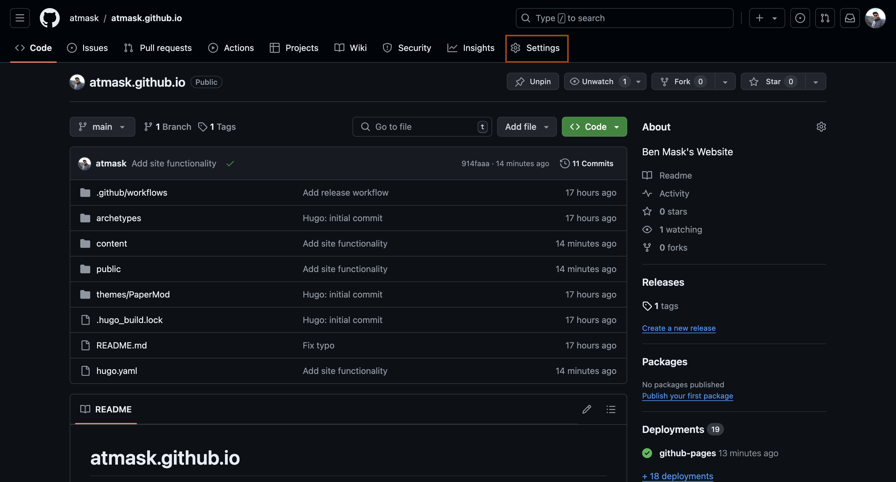
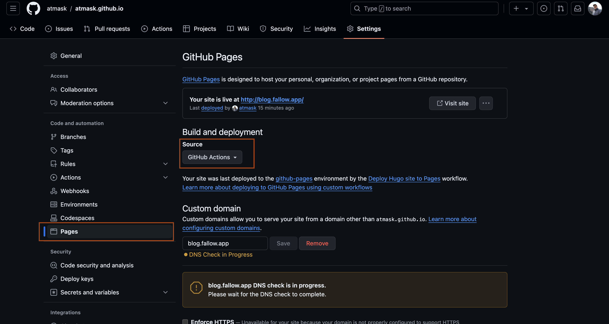

# Big Idea

The goal of this post is to capture the steps required to get started with Hugo and GitHub Pages. Hugo is a Go-based static site generation tool. GitHub Pages is a feature of GitHub that allows anyone with a GitHub account to host a static site.


# Part 1: Setting up GitHub Pages
In order to serve your site, you will need somewhere to host it. GitHub offers a free service called GitHub Pages that we will use for this purpose. GitHub Pages offers the free hosting of static website content. This means we will be able to build our Hugo site into a static site and then serve that via 
GitHub Pages.


### Create GitHub Pages Repo
To get started with GitHub Pages for your blog, you will first need a repo in which you'll store your website content. GitHub Pages offers websites for individual projects or for your user. For this tutorial, we will use the user GitHub Pages. The first step to creating this Pages site is creating a repo in your GitHub account that follows the naming scheme: `<username>.github.io` (substitute `<username>` with your GitHub username). Select **Initialize this repository with a README** and then create the repo.

> **Note:** Your repository must be a public repo for Pages to work.

After creating your repository, navigate to 
the repository's main page and click on **Settings**:


From the Settings page navigate to the **Pages** under **Code and Automation** on the side menu:


From here you will want to change your **Build and deployment** configuration to GitHub Actions. This will be required later when we want to specify a GitHub Actions workflow to build our static site content with Hugo.

For now, leave the **Custom domain** configuration alone. We will return to this at a later step.

# Part 2: Setting Up Hugo
The following section covers getting your static site running on your local machine. This will allow you to modify your themes and posts from your editor of choice and see updates via the local Hugo dev server.

### Install Hugo to your local machine
To get started with Hugo on your machine you'll need to first install Hugo. On macOS, you can do this via Brew:
```bash
brew install hugo
```

### Create a New Hugo Site Locally

To start a new Hugo project run:
```bash
hugo new site <github-username>.github.io --format yaml
```
> **Note:** Using `--format yaml` is optional. The default config format for Hugo is toml.

This will create a new directory named `<github-username>.github.io` that is pre-populated with the Hugo starter boilerplate. You don't have to use the site name `<github-username>.github.io`. You can change it to whatever you would like. However, in the case of GitHub Pages, you created your Pages site in a repo named `<github-username>.github.io`. To keep naming consistent use the name of the existing repo.


### Connect your local Hugo Project to the Git Repo
Now that you have created a new Hugo site you will want to connect it to the GitHub repository you created earlier. To do this we will first initialize your new local project as a git project. This can be done by entering your project directory and then running `git init`
```bash
cd <github-username>.github.io/
git init
```
This enables version control for your project. Let's create an initial commit of the Hugo site and push to GitHub:
```bash
git add .
git commit -m "Initial commit"
git branch -M main
git remote add origin <git clone url>
git push -u origin main --force ## Use force in this case to override the README in github with new history
```
> **Note:** You can get the git clone url by navigating to your repository, selecting **Clone** and grabbing the https or ssh clone link. Select the ssh link if you have ssh set up for GitHub. This will keep you from having to enter your credentials on each push.


### Add a Hugo Theme to your site

By default, Hugo does not include a theme for your site. This is where you get to pick how you want your site to look once built and deployed. You can find a complete list of themes on the [Hugo themes page](https://themes.gohugo.io/). For this example, I will use the theme [PaperMod](https://themes.gohugo.io/themes/hugo-papermod/) as that is the theme of this blog.

Once you have selected a theme, you will want to clone that theme into the `/themes` directory contained within the Hugo project created above. There are two common ways that others online will recommend doing this. One way requires downloading the theme's repo as a zip file from GitHub, extracting the contents and moving them into the `/themes` directory. This method does not maintain the git history of the selected theme. It means that as the upstream theme repo changes you will not be able to pull those changes via git. The second method involves cloning the theme repo into `/themes` and declaring it as a git submodule within the enveloping git repo you created earlier. I don't intend on maintaining my theme heavily so I will not bother with the latter approach. I also find downloading and unzipping tedious. I recommend cloning your theme into `/themes` and then dropping the `.git` management from the clone. This is done as follows:

```bash
## Clone PaperMod theme to /themes/PaperMod. Only grab depth 1
git submodule add --depth=1 https://github.com/adityatelange/hugo-PaperMod.git themes/PaperMod

## Remove the git history from the cloned PaperMod repo
rm -rf /themes/PaperMod/.git
```

Now that you have a theme, you need to tell Hugo to use it. To do so, edit your `hugo.yaml` and add
```yaml
theme:
  - PaperMod ## If you chose a different theme put the name of the theme here. This is the folder under /themes that contains the theme
```

### Run Hugo Locally
You can now run your site locally by running `hugo server` from the terminal within your project. This brings up your site at [http://localhost:1313/](http://localhost:1313/).

You can change the title on your site by editing the `hugo.yaml` file. All PaperMod features and customizations can be found documented here: [PaperMod Features](https://github.com/adityatelange/hugo-PaperMod/wiki/Features)

### Deploy to GitHub Pages

Next, we will deploy to GitHub Pages. Remember that earlier we changed the **Build and deployment** setting to GitHub Actions. This means that we need to specify a GitHub Actions workflow for GitHub Runners to execute when you push your repo. GitHub Actions are a series of jobs that will be performed on your code base when you push to GitHub. In our case we will use GitHub Actions to build our Hugo site and deploy to Pages. To do this we must create the following workflow file in our repo: `<github-username>.github.io/.github/workflows/hugo.yaml`
```yaml
# Sample workflow for building and deploying a Hugo site to GitHub Pages
name: Deploy Hugo site to Pages

on:
  # Runs on pushes targeting the default branch
  push:
    branches:
      - main

  # Allows you to run this workflow manually from the Actions tab
  workflow_dispatch:

# Sets permissions of the GITHUB_TOKEN to allow deployment to GitHub Pages
permissions:
  contents: read
  Pages: write
  id-token: write

# Allow only one concurrent deployment, skipping runs queued between the run in-progress and latest queued.
# However, do NOT cancel in-progress runs as we want to allow these production deployments to complete.
concurrency:
  group: "Pages"
  cancel-in-progress: false

# Default to bash
defaults:
  run:
    shell: bash

jobs:
  # Build job
  build:
    runs-on: ubuntu-latest
    env:
      HUGO_VERSION: 0.128.0
    steps:
      - name: Install Hugo CLI
        run: |
          wget -O ${{ runner.temp }}/hugo.deb https://github.com/gohugoio/hugo/releases/download/v${HUGO_VERSION}/hugo_extended_${HUGO_VERSION}_linux-amd64.deb \
          && sudo dpkg -i ${{ runner.temp }}/hugo.deb          
      - name: Install Dart Sass
        run: sudo snap install dart-sass
      - name: Checkout
        uses: actions/checkout@v4
        with:
          submodules: recursive
          fetch-depth: 0
      - name: Setup Pages
        id: Pages
        uses: actions/configure-Pages@v5
      - name: Install Node.js dependencies
        run: "[[ -f package-lock.json || -f npm-shrinkwrap.json ]] && npm ci || true"
      - name: Build with Hugo
        env:
          HUGO_CACHEDIR: ${{ runner.temp }}/hugo_cache
          HUGO_ENVIRONMENT: production
          TZ: America/Los_Angeles
        run: |
          hugo \
            --gc \
            --minify \
            --baseURL "${{ steps.Pages.outputs.base_url }}/"          
      - name: Upload artifact
        uses: actions/upload-Pages-artifact@v3
        with:
          path: ./public

  # Deployment job
  deploy:
    environment:
      name: github-Pages
      url: ${{ steps.deployment.outputs.page_url }}
    runs-on: ubuntu-latest
    needs: build
    steps:
      - name: Deploy to GitHub Pages
        id: deployment
        uses: actions/deploy-Pages@v4
```

After adding this run:
```bash
git add .
git commit -m "Add theme and release workflow"
git push
```

This will push your changes to GitHub. From the GitHub repo page for your project you can open the **Actions** tab to see your defined workflow running. Once this has completed you can navigate to `<github-username>.github.io` to view your site! This could take ~10 mins to become visible so don't worry if you don't see it right away.

# Part 3: Adding a Custom Domain
To add a custom domain you will need to follow a few steps. First, if you do not have one already, you will need to purchase a domain from a registrar such as Cloudflare, GoDaddy, or NameCheap. Doing this is beyond the scope of this blog and there are multitudes of online guides that will explain this in more detail than I can here.

### Specify Domain in GitHub Pages
After acquiring a domain, return to the Pages tab under **Settings > Build and Automation > Pages** in GitHub. Here you will see the **Custom domain** option. Add your domain to the custom domain settings. This can be the Apex domain such as `fallow.app` if you want your blog to be the root page of your domain. If you'd prefer to host your blog on a subdomain such as `blog.fallow.app` then enter that as your custom domain.. Replace `fallow.app` with your domain.

### Configure CNAME Record in your DNS Provider.
The registrar from whom you purchased your domain will have DNS settings available for your domain. There are two main DNS record types `A records` and `CNAME records`. An A record points to an IP. CNAME records are aliases to other domains. In our case we will create a CNAME record to our GitHub Pages domain. If you are doing this for the subdomain `blog.<your domain>`, then add `blog` as your CNAME record and `<github-username>.github.io` as your target. If you are doing this for the Apex domain (i.e. no subdomain), then use `@` (this represents the apex domain) instead of `blog`.

> **Note:** DNS records take a while to propagate. You will no longer be able to reach your blog at `<github-username>.github.io` and it may take 24hrs for your site to become available. In my experience, it has never been that long and has taken at most 30 mins.

