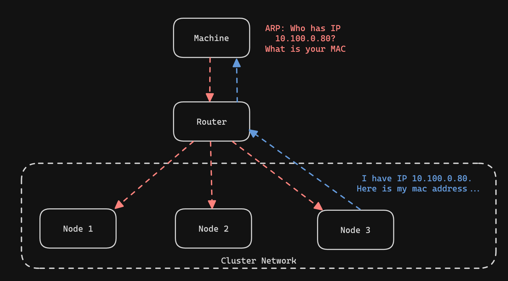

# Big Idea

In part 1 of this post, I covered the basics of getting started building my Kubernetes cluster on Raspberry Pis. In particular, I laid out my goals and requirements, the build list, the network topology and setup, and the installation of K3s on each of the nodes. I recommend going back and checking out that post first if you haven't already ([Part 1: Building a Bare-metal Kubernetes Cluster on Raspberry Pis](https://blog.fallow.app/posts/02-bare-metal-k3s-on-rpi-part-1/)).

A summary from that post is that I created the subnet `10.100.0.0/24` on my home network for the cluster network. Using DHCP I reserved a small address space of IPs for my nodes and statically assigned the node IPs from within that range. Of my four RPis, three will be part of the cluster. The fourth node will not run as part of the cluster but will instead run a TailScale subnet router and Pi-Hole for DNS resolution on the cluster network.

In this post, I will review how I configured the Nginx Ingress controller and Cert-Manager for managing HTTPs traffic to my cluster. I will also cover my persistent storage solution that implements PV's in Kubernetes using an SMB share. Finally, I will briefly show my backup strategy that leverages rclone and Backblaze B2 storage. 

As usual, all of my configurations for deploying charts can be found on my GitHub: https://github.com/atmask/helm-charts/tree/main

# Load-Balancing, Ingress, and SSL/TLS Management

Now that I had my cluster up and running with a CNI installed (I'll do more posts about Calico CNI in the future) I wanted to get the networking setup to access services on my cluster. To achieve this, I added three different installations to my cluster: MetalLB, Nginx Ingress, and Cert-Manager. 

Kubernetes has a resource type called Services. Services function as load balancers by providing a single IP for balancing traffic among a backing set of ephemeral pods running a workload. Kubernetes services resources have a few kinds, namely, ClusterIP, NodePort, and LoadBalancer. There are default implementations for the first two service types in Kubernetes but none for LoadBalancer-type services. Most major cloud providers you use will have their own implementation with their Kubernetes offerings that will configure a Load Balancer with a public IP from their platform to manage the incoming traffic to your service. MetalLB is a solution for those running their own Kubernetes clusters to support services of type LoadBalancer. 

Nginx-Ingress is an Nginx-based solution for managing network traffic entering the cluster. To use the nginx ingress controller, you expose it behind a LoadBalancer. All incoming traffic can then be routed based on various routing rules such as the path to other services in the cluster. This has the advantage of having a single point for managing TLS termination and in cloud environments can save you the cost additional LBs would incur if you exposed each service via an LB.

Finally, Cert-Manager. Cert-Manager is an X.509 certificate management service for Kubernetes. It integrates nicely with Let's Encrypt for automatically generating and rotating SSL/TLS certs on domains that you own. It also (with some configuration) integrates with Nginx Ingress for automatically provisioning and managing certificates for new domains and subdomains. 


## MetalLB Concepts

#### IPPools
MetalLB is not able to give you IP addresses out of thin air. This means that you will need to tell it which IP addresses it can allocate to LoadBalancer services by defining IPPools for your MetalLB installation to use. This IPPool should not overlap with the IP range that the DHCP is configured to assign IPs from. This is where it may be helpful to share the network topology again:


#### External Announcements and Layer 2 Routing
MetalLB can assign an IP to your LoadBalancer Kubernetes service, however, it also needs to make the network outside of your cluster pod traffic aware of these IPs to make them routable. MetalLB has two different modes for achieving this goal: BGP and Layer 2. I will focus on Layer 2 mode as that is what I am running and familiar with.

MetalLB in Layer 2 mode works by taking an available IP from the IPPool that you previously allocated and assigning that IP to a node in your cluster. From an outside perspective, it looks as if the node has multiple IPs on the network. This is called Layer 2 mode because of how it makes use of ARP (address resolution protocol). ARP is a protocol that takes place in layer 2 of the OSI networking model. In short, ARP works by the source machine sending out a broadcast message for the destination IP of the packet it is trying to route. If a machine has that IP leased then it responds to the original ARP request by returning its MAC address. The MAC address is then used in layer 2 networking to send the packet on to the node in the cluster.



Once the packet is routed to the node in the cluster then `kube-proxy` takes over and routes the packet to one of the services. `kubey-proxy` is an agent that manages iptables in the cluster to support the routing of packets from the virtual IPs of services to the IPs of pods assigned via the CNI. This may be the subject of another post in the future but for now, I'd refer you to this article: [Kube-Proxy: What is it and How it Works](https://medium.com/@amroessameldin/kube-proxy-what-is-it-and-how-it-works-6def85d9bc8f)


#### Deploying MetalLB

Now, to the fun part! MetalLB can be deployed via Helm charts to your cluster. The Helm chart can be found on Artifact Hub. The first install of the MetalLB chart additionally installs custom CRDs to the cluster. CRDs are "Custom Resource Definitions" and allow for the creation of custom resources (like pods or deployments) but more relevant to a specific application. In the case of MetalLB, we care about the `IPAddressPool` and `L2Advertisement` CRDs. After the initial install of the chart, we will want to deploy an `IPAddressPool` resource to to tell MetalLB what IP range we have set aside in our subnet for LoadBalancer IPs. We will also deploy an `L2Advertisement` resource that tells Metallb to advertise IPs in that pool via Layer 2 networking.

I prefer to use Helm's subcharting functionality to keep all of my chart configurations and versions in VCS over time but, in general, the installation process would look like this:
```bash
helm install -n metallb metallb oci://registry-1.docker.io/bitnamicharts/metallb --create-namespace
```

Then create the `IPAddressPool` in `ippool.yaml`
```yaml
# The address-pools lists the IP addresses that MetalLB is
# allowed to allocate. You can have as many
# address pools as you want.
apiVersion: metallb.io/v1beta1
kind: IPAddressPool
metadata:
  # A name for the address pool. Services can request allocation
  # from a specific address pool using this name.
  name: lb-ip-pool
  namespace: metallb-system
spec:
  # A list of IP address ranges over which MetalLB has
  # authority. You can list multiple ranges in a single pool, they
  # will all share the same settings. Each range can be either a
  # CIDR prefix, or an explicit start-end range of IPs.
  addresses:
  - 10.100.0.50-10.100.0.75
```

and the `L2Advertisement` in `advertisement-l2.yaml`
```yaml
apiVersion: metallb.io/v1beta1
kind: L2Advertisement
metadata:
  name: ip-pool-advertisement
  namespace: metallb-system
spec:
  ipAddressPools:
  - lb-ip-pool
```

then apply both files to the cluster:
```bash
kubectl apply -n metallb -f ippool.yaml
kubectl apply -n metallb -f advertisement-l2.yaml
```

>**Note:** This is the quick and dirty way to do this. I reccommend checking out my repo linked at the start of this article to see how subchartting can be used for maintaining the configuration of third-party charts.

#### Validate with LoadBalancer
If you don't have any applications deployed and want to validate that the metallb installation is working you can apply the following LoadBalancer Service to your cluster and verify that an IP from your `IPPool` is attached to the service as an `external-ip`
```yaml
### lb-svc.yaml
apiVersion: v1
kind: Service
metadata:
  name: my-service
  namespace: default
spec:
  selector:
    app: my-app
  ports:
    - protocol: TCP
      port: 80
      targetPort: 8080
  type: LoadBalancer
```
and apply with `kubectl apply -f lb-svc.yaml`. Then use `kubectl get svc` to verify that an external-ip has been assigned to the service named "my-service".


## Deploying Nginx-Ingress

Now that we can provision IPs for an implementation of LoadBalancer-type services we can move on to our installation of Nginx Ingress. Yes, technically, NodePort could have been used instead of setting up MetalLB but this is about learning new things! The Nginx Ingress controller will act as a single point of entry for all traffic to workloads running in my cluster. Nginx Ingress supports host and path-based routing and I will make use of this when setting DNS records for my apps later on. A large benefit of using Nginx Ingress as a single point of entry for all incoming traffic is that I can integrate Nginx Ingress with Cert-Manager so that it is also the single point for managing all TLS termination of incoming traffic. This reduces the management overhead for me.

As with MetalLB, my configuration of the Nginx Ingress controller chart can be found in my charts repo linked at the top of this post. There is a lot less configuration to do for this deployment. I will provide a quick and dirty installation here as well though. All that you need to configure via the values file is the service resource that will act as the load balancer to the ingress controller.
```yaml
### nginx-ingress-values.yaml
controller:
service:
    enabled: true
    type: "LoadBalancer"
    annotations:
      metallb.universe.tf/address-pool: lb-ip-pool # Add the annotation so that metallb will use the previously configured ippool
```

and then install:

```bash
helm repo add ingress-nginx https://kubernetes.github.io/ingress-nginx
helm repo update
helm install -n nginx-ingress nginx-ingress ingress-nginx/ingress-nginx -f nginx-ingress-values.yaml --create-namespace
```
Hura-ah! The Nginx Ingress controller should now be installed. It will watch of the creation `ingress` resources in the cluster. `ingress` resources are typically deployed with your application and configure how the Nginx Ingress Controller should route traffic to that application.


## Configuring Cert-Manager

As of right now, with MetalLB and the Nginx Ingress controller set up, I would be ready to access my applications. The problem is, any web browser will give me a page saying that the page I am trying to access is insecure and I would have to click through to access my applications. This is an annoyance and so I have set up Cert-Manager to solve this problem. 

Cert-Manager is a tool that can be integrated with Nginx Ingress to automatically provision and rotate SSL/TLS certs for your domains. The SSL/TLS certs are used to encrypt the HTTP traffic between your servers and clients. This is what gives us HTTPs.

An important thing to know before setting up Cert-Manager is that SSL/TLS certificates can _only be issued for domains that you own_. When Cert-Manager attempts to provision or rotate a cert for your service it must pass one of two tests known as ACME challenges (`DNS-01` or `HTTP-01`) to verify that you are the owner of the domain for which you are provisioning a certificate.

#### Installing Cert-Manager

Cert-Manager, like MetalLB, has a set of CRDs that are needed for configuring the installation. This means that I had to do the initial Helm install to get the CRDs and then a subsequent Helm upgrade to add configurations. There is one additional CRD needed when setting up Cert-Manager. The required CRD, for my use case and setup at least, is the `ClusterIssuer`. The `ClusterIssuer` configures which Certificate Authority (CA) Cert-Manager will use to generate the SSL/TLS certificates. In my installation, I have used Let's Encrypt as my CA. Let's Encrypt provides free certificates and has a generous quota on their production service.

The initial Cert-Manager installation can be added as follows:
```bash
helm repo add jetstack https://charts.jetstack.io --force-update
helm install cert-manager -n cert-manager --version v1.15.1 jetstack/cert-manager --set installCRDs=true --create-namespace
```

After the initial installation, I deployed the `ClusterIssuer`. As I mentioned earlier, certificates can only be issued for domains that you own. This means that the 
CA you choose will attempt to execute a `DNS-01` or `HTTP-01` challenge successfully before provisioning your cert. `DNS-01` is more secure so I cover that here. With `DNS-01`
you must configure your `ClusterIssuer` with an API key for the registrar where you manage your domain. In my case, this is Cloudflare. The `DNS-01` challenge works by the CA requesting that you configure a `TXT` record on your domain with specific values that the CA provides under the subdomain `_acme-challenge.<YOUR_DOMAIN>`. If the CA validates that this has been done, then your ownership of the domain is verified and the certificate is issued. Using my provided API key, Cert-Manager will do this all on my behalf.

```yaml
## cluster-issuer.yaml
apiVersion: cert-manager.io/v1
kind: ClusterIssuer
metadata:
  name: letsencrypt
spec:
  acme:
    # You must replace this email address with your own.
    # Let's Encrypt will use this to contact you about expiring
    # certificates, and issues related to your account.
    email: <your email>
    server: https://acme-v02.api.letsencrypt.org/directory
    privateKeySecretRef:
      # Secret resource that will be used to store the account's private key.
      name: <arbitrary secret name where your acme account key will be stored once generated>
    # Add a single challenge solver
    solvers:
      - dns01:
          cloudflare:
            apiTokenSecretRef:
              name: registrar-api-key
              key: api-token
```

```yaml
## secret.yaml
apiVersion: v1
kind: Secret
metadata:
  name: registrar-api-key
type: Opaque
stringData:
  api-token: {{ .Values.cloudflareApiToken }}
```

> **Note:** If you are setting this up for the first time it is recommended to use the Let's Encrypt staging servers to not waste your quota on the production servers. The staging server can be gotten by replacing `acme-v02` with `acme-staging-v02` in the `server` configuration.

With Cert-Manager and a `ClusterIssuer` installed, I was now able to create new `ingress` resources containing routing rules and integrated with Cert-Manager via annotations for the automatic provisioning of SSL/TLS certs. Using the API token for Cloudflare, Cert-Manager completes the `DNS-01` ACME challenge on my behalf.

## Local DNS Management with Pi-Hole

One more small detail about my cluster pertains to DNS records. I did not want all the DNS records for my services available on the public internet. Although the services running on my local network would be unreachable to anyone on the public internet, storing the DNS records with the private IPs for my hosted services in Cloudflare or any other public DNS provider would have meant that anyone could discover the private IPs at which I host services. For me, this was not ideal. This was the motivation for setting up Pi-Hole as a DNS server on my home network. Pi-Hole will act like an Azure Private DNS Zone or Private Hosted Zones in  AWS Route53.

The first step to achieving this goal was installing Pi-Hole on one of my Pis. I chose to do the installation on `stoneward` (refer to the network diagram for the naming of my nodes). This is the same Pi that runs TailScale and does not serve any role in the K3s cluster. After completing the Pi-Hole installation I was able to navigate to **Local DNS > DNS Records** in the Pi-Hole admin web UI and configure DNS records for reaching the nginx-ingress controller and other common IPs such as the cluster node IPs.

> Note: I had to adjust the DNS server's **Interface Settings** in the Pi-Hole admin web UI. By default, only local requests from devices one hop away are allowed which does not work with my Tailnat. Since my DNS server is only accessible on my private home network I changed this setting to permit all origins for DNS queries.

The second and final step for setting up the private DNS requires configuring TailScale. The TailScale admin portal allows you to configure the DNS nameserver to use for anyone connecting to your Tailnet. This must be updated with the IP of `stoneward` and the override local DNS setting set to true. When this is configured. All DNS requests for users connected to your Tailnet will be routed via the Subnet Router's advertised CIDR range to the DNS running at home. This will allow only users connected to my local network to resolve the DNS records for services running in my homelab.


# Persistent Storage

The final part of my cluster configuration that I will cover in this post is my implementation of persistent storage. I wanted to be able to have a reliable persistent storage solution as I intend to store data that matters to me on my services. However, I also wanted a solution that required a small amount of effort and minimal cost. This ruled out using Kubernetes `hostPath` since the micro SD cards that act as my primary storage on the RPis in not very reliable. The `hostPath` solution also has the issue that data would be tied to a specific node meaning that pods could not be scheduled interchangeably on any node. Exploring a distributed file storage solution such as Rook Ceph or Longhorn was interesting to me but not something I really had the bandwidth to explore and seemed overkill for my use case.

In order to de-couple my storage solution from the nodes I chose to set up a 1TB SSD as an SMB share that could be mounted by any node in the cluster via the [SBM CSI driver](https://github.com/kubernetes-csi/csi-driver-smb). The SMB CSI driver is a Kubernetes CSI implementation that enables pods to access an SMB share via Persistent Volumes and Persistent Volume Claims. 


### Creating the SMB share

When I set up my cluster, I only had one node that had a significant amount of RAM. This was my k3s master node, `bondsmith`, which had 8Gb of memory. As a result, I decided to expose the 1TB SSD from this node

I connected my 1 TB SSD to the Pi through a SATA to USB converter cable. The cluster case I used also had a convenient place to mount the drive on the same ejectable rack that the Pi was connected to. After powering on the PI with the PoE connection I connected the Tb drive and configured the SMB share.

The first part of setting up the SMB share was installing Samba to the `bondsmith` node. After installation I mounted the TB drive to the `/nas` dir at the root of my machine. Using the `lsblk` command I was able to find my drive on the system and then use the `mount` command to mount the drive to the `/nas` dir. 
```bash
## Mount the drive
sudo mount /dev/sda2 /nas
```

> Note: It's a good idea to create a new user and group for access to the SMB share on the system. I created a user and group for SMB users and changed the access permissions and ownership of the mounted drive to that user

Once the drive is mounted you can configure Samba to share the drive to the network. This can be done by configuring and `smb.conf` file and restarting the smb service.

``` toml
## /etc/samba/smb.conf
[nas]
path=/nas
writeable=Yes
create mask=0777
directory mask=0777
public=no
```

The last step is adding the newly created smb user to Samba using `smbpasswd`.

### Setting up the SMB CSI Driver

The SMB CSI driver was easily installed into the cluster via the Helm chart. In order to enable the use of PVCs/PVs it was necessary to configure a StorageClass resource along with the Helm chart. The storage class specifies the connection details for mounting the SMB share. The storage class is then used in PVCs to automatically connect to the network drive and access data. 

```yaml
## storageclass.yaml
apiVersion: storage.k8s.io/v1
kind: StorageClass
metadata:
  name: smb
provisioner: smb.csi.k8s.io
parameters:
  source: //<ip of the node>/<path to the smb share>
  # if csi.storage.k8s.io/provisioner-secret is provided, will create a sub directory
  # with PV name under source
  csi.storage.k8s.io/provisioner-secret-name: smbcreds 
  csi.storage.k8s.io/provisioner-secret-namespace: default
  csi.storage.k8s.io/node-stage-secret-name: smbcreds
  csi.storage.k8s.io/node-stage-secret-namespace: default
reclaimPolicy: Delete  # available values: Delete, Retain
volumeBindingMode: Immediate
mountOptions:
  - dir_mode=0777
  - file_mode=0777
  - uid=1001
  - gid=1001
  - nobrl 
  # details on using nobrl:
  ## https://learn.microsoft.com/en-us/troubleshoot/azure/azure-kubernetes/storage/mountoptions-settings-azure-files#other-useful-settings
  ## https://github.com/dani-garcia/vaultwarden/issues/846
```

You will also need to create a secret containing the username and password for connecting to the SMB drive:
```bash
kubectl create secret generic smbcreds --from-literal username=<USERNAME> --from-literal password=<PASSWORD>
```

### Testing PVC/PV Creation
After the above is installed and set up, I was able to validate that storage was provisioned when specifying the persistent volume claim. 

```yaml
apiVersion: apps/v1
kind: StatefulSet
metadata:
  name: ss-smb
  labels:
    app: busybox
spec:
  replicas: 1
  template:
    metadata:
      labels:
        app: busybox
    spec:
      containers:
        - name: ss-smb
          image: alpine:latest
          command:
            - sleep
            - infinity
          volumeMounts:
            - name: smb
              mountPath: "/sc/smb"
      tolerations:
        - key: "node.kubernetes.io/os"
          operator: "Exists"
          effect: "NoSchedule"
  updateStrategy:
    type: RollingUpdate
  selector:
    matchLabels:
      app: busybox
  volumeClaimTemplates:
    - metadata:
        name: smb
        annotations:
          volume.beta.kubernetes.io/storage-class: smb
      spec:
        accessModes: ["ReadWriteMany"]
        resources:
          requests:
            storage: 10Gi
```


# Backups with rclone and Backblaze

I wanted to make sure that I keep backups of all my data somewhere cheap in case I need to do some disaster recovery. I chose to use Backblaze since it has an S3 compatible API and is cheap. There are many guides for authenticating to Backblaze with rclone and k3s so I will just add the commands here in case I need to reference them in the future.

> Note: I did not use an in-cluster back-up tool like Velero and Rustic because they require snapshot capabilities from the CSI driver and the SMB CSI driver does not support this.


### Backing up the SMB drive
```bash
rclone sync -P /nas/ b2:<bucket name>
```

### Backing up etcd

```bash
k3s etcd-snapshot save --s3 --s3-endpoint <backblaze endpoint> --s3-bucket <backblaze bucket> --s3-access-key <bb access key> --s3-secret-key <bb secret key>
```