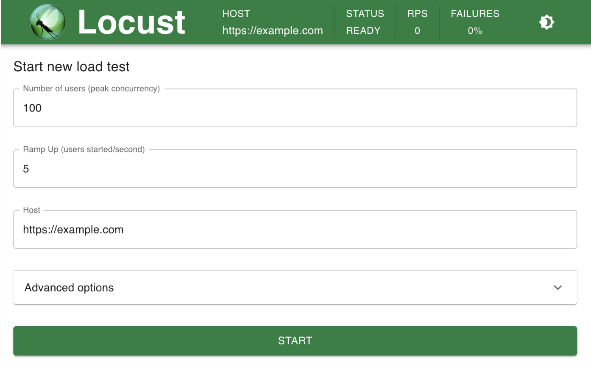
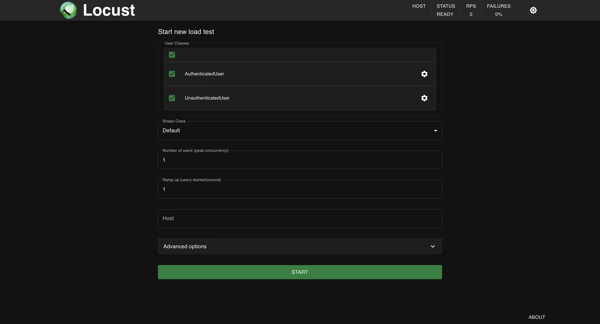

# Big Idea

I was recently tasked with configuring automated load tests to validate the health of a service under load and to identify bottlenecks and limits at which the service became overloaded. Up until this point, I had not worked first-hand with any load-testing frameworks. Although there are many great load testing tools out there like JMeter, K6s, and Locust, I decided to get started with Locust as it is a framework I had heard of before and is a pure Python framework (Python is the language I think in right now). To rewind, load testing frameworks allow engineers to programmatically produce stress on a system by simulating a large volume of incoming requests to that system. Requests can be, but are not limited to, HTTP calls. You can also load test with gRPC or IoT protocols like MQTT. Locust is an open-source Python-based load testing framework. With Locust, all user behaviour is defined in Python code and tests can be executed from a single machine or distributed across many machines.

If you'd like to borrow a template for starting a Locust project, you can find my Locust boilerplate project on GitHub: https://github.com/atmask/locust-template

# Setting Up my First Locust Project

When setting up my Locust project, I decided to manage my project with `poetry`. `poetry` is a tool for managing the different aspect of Python projects, such as dependencies and packaging, in a deterministic way.

To get started, I set up the following basic project structure:
```plaintext
locust-tests
│
├── LoadTests
│   ├── __init__.py
│   ├── locustfile.py
│   └── settings.py
└── README.md
```
> **Note:** # Do not worry about the contents of the `LoadTests/` dir. I have added them but for now, the files can be left blank

## Installing Dependencies and Virtual Environment Setup

I won't go into detail about the installation and general usage of `poetry` here but will provide the steps to get the project up and running. 

> 🛠️ **Note:** If you don't care to use `poetry`, you can also just add a venv using `python -m venv .venv` and set up the following `requirements.txt` file for something quick and easy:
>  ```bash
>  # requirements.txt file
>  locust
>  ```

First, initialize the new `poetry` managed project from `/locust-tests`:
```bash
poetry init
```

I like to have my virtual environment contained within my project so I also add a `poetry.toml` file to the root of my project with:
```toml
[virtualenvs]
in-project = true
```

Finally, you can add the dependencies using `potery add`. This will install the package along with its dependencies and store the dependencies in the `pyproject.toml` file and a `poetry.lock` file.
```bash
poetry add locust
```

Your project structure should now resemble the following:

```plaintext
locust-tests
│
├── LoadTests
│   ├── __init__.py
│   ├── locustfile.py
│   └── settings.py
├── README.md
├── poetry.lock
├── poetry.toml
├── pyproject.toml
└── struct.txt
```

## Writing a Simple Locust Test

To get started let's write a simple test that visits the main page for a website. To do this we have to write a class that represents some type of "user" of the system. We will give this user behaviours by writing functions and decorating those functions with `@task` decorator. When Locust runs, it will, by default, find all of the defined User classes in `locutfile.py` and randomly execute the `@task` decorated functions.

Here is an example for a first test. This example User class extends Locust's base HttpUser class and defines a behaviour/task for visiting the root page of a site.

```python
# locustfile.py
from locust import HttpUser, task

class WebUser(HttpUser):
    @task
    def visit_main_page(self):
        '''Visit the main page of the domain'''
        self.client.get("/")
```

You may notice that the `GET` request does not specify a domain or scheme. This is because the Locust UI allows you to configure the domain you will run requests against interactively. Locust then builds an `Environment` object that gets passed to the `HttpUser` class (and any class that extends it) in the constructor. The `client` then automatically uses the configured domain as the base url for the requests.

You can now launch the Locust server and run this first Locust test!
```bash

## If you are using poetry
poetry shell

## If you are using a venv
. .venv/bin/activate

## Enter the project containing the locustfile.py and run the locust server
cd LoadTests/
locust

## Expected output
>>> Starting web interface at http://0.0.0.0:8089
```

You should be able to navigate to the above url in your browser and see the Locust UI.
 


## Managing Different Types of Application Use Cases

In reality, you'll want to add more complex behaviours to your load tests. You likely also want to group the behaviours/tasks that you are automating to run against your server into different groups of user classes. This will let you define the behaviours of users in different scenarios such as an unauthenticated user vs an authenticated user.

I will provide a project structure that seems scalable and maintainable to me from a code perspective for expanding to this next part of developing a Locust project. This project structure adds an additional package named `behaviours`. You could name it `users` but I chose what I felt was most clear to me. In this package, we can define different subclasses of HttpUser and group related behaviours inside User classes. In this example, I have added an unauthenticated user and an authenticated user.

```plaintext
locust-tests
│
├── LoadTests
│   ├── behaviours
│   │   ├── __init__.py
│   │   ├── unauthenticatedUser.py
│   │   └── authenticatedUser.py
│   ├── __init__.py
│   ├── locustfile.py
│   └── settings.py
├── README.md
├── poetry.lock
├── poetry.toml
├── pyproject.toml
└── struct.txt
```

Here is some example content for the unauthenticated user:

```python
## LoadTests/behaviours/unauthenticatedUser.py
from locust import HttpUser, task

class UnauthenticatedUser(HttpUser):
    @task
    def visit_main_page(self):
        '''Visit the main page of the domain'''
        self.client.get("/")

    @task
    def visit_register_page(self):
        '''Visit the registration page'''
        self.client.get("/register")
```

Now, you might be wondering: "What about an authenticated user? How do I manage logging in? Do I need to do this before each test?". All great questions. I will first answer them with a naive solution and then improve upon that answer below.

## Managing Authentication and Secrets

Let's take a look at setting up our `authenticatedUser`:

```python
## LoadTests/behaviours/authenticatedUser.py
import HttpUser, task
from dataclasses import dataclass
from requests.auth import HTTPBasicAuth

@dataclass
class UserAuthConfig:
    username: str
    password: str

class AuthenticatedUser(HttpUser):

    def __init__(self, user_auth_config: UserAuthConfig, *args, **kwargs):
        self._user_auth_config = user_auth_config
        super().__init__(*args, **kwargs)

    def on_start(self):
        '''Locust call on_start when a simulated user starts running'''
        self.login()

    def login(self):
        '''Login using basic auth'''
        response = requests.get(
            '/login', 
            auth=HTTPBasicAuth(self._user_auth_config.username, self._user_auth_config.password)
        )

    @task
    def visit_profile(self):
        '''Visit the authenticated user's profile'''
        self.client.get('/profile')
```

This is great! But what if your application supports different authentication mechanisms? And what if multiple different user's all need authentication? This is where we can improve the above example by adding some additional structuring to the project to keep things DRY and consistent. This will be done by creating an interface that must be implemented by all authenticated user classes and adding a couple of authentication base classes to implement the interface with different auth mechanisms.

Let's look at the new project structure with the changes that will be introduced:

```plaintext
locust-tests
│
├── LoadTests
│   ├── authentication
│   │   ├── __init__.py
│   │   ├── interface.py
│   │   ├── oauth.py
│   │   └── token.py
│   │ 
│   ├── behaviours
│   │   ├── __init__.py
│   │   ├── unauthenticatedUser.py
│   │   └── authenticatedUser.py
│   ├── __init__.py
│   ├── locustfile.py
│   └── settings.py
├── README.md
├── poetry.lock
├── poetry.toml
├── pyproject.toml
└── struct.txt
```


Let's take a look at the contents of each file. First, the interface

```python
## LoadTests/authentication/interface.py
import HttpUser
from abc import abstractmethod

class IAuthUser(HttpUser):
    
    def on_start(self):
        '''Add the call to authenticate when the user starts'''
        self._authenticate_user()
    
    @abstractmethod
    def _authenticate_user(self):
        '''Authenticate the user via the auth mechanism'''
```

Now, let's look at an example with token authentication

```python
from LoadTests.authentication,interface import IAuthUser

@dataclass
class UserAuthConfig:
    username: str
    password: str

class TokenAuthUser(IAuthUser):

    def __init__(self, user_auth_config: UserAuthConfig, *args, **kwargs):
        self._user_auth_config = user_auth_config
        self._token = None
        super().__init__(*args, **kwargs)

    def _authenticate_user(self):
        '''Implement the authentication method using basic auth'''
        response = requests.get(
            '/login', 
            auth=HTTPBasicAuth(self._user_auth_config.username, self._user_auth_config.password)
        )

        # Grab the token (yes...no validation for this example)
        token = response.json().get("token")
```


Now that we have these classes we can simplify the original `authenticatedUser` class:

```python
## LoadTests/behaviours/authenticatedUser.py
from LoadTests.authentication.token import TokenAuthUser, UserAuthConfig


class AuthenticatedUser(TokenAuthUser):
    '''Define a collection of tasks that can be performed by an authenticated user'''
    @task
    def visit_profile(self):
        '''Visit the authenticated user's profile'''
        self.client.get('/profile')
```

This reduces the scope of the `AuthenticatedUser` class and makes it easier to set up another class extending the TokenAuthUser. One could imagine having a class for `AdminUser` and `EditorUser` and defining behaviours for each type where these both extend `TokenAuthUser`.


This final step to run this new configuration involves importing the behaviour classes into the Locustfile and configuring them:

```python
## LoadTests/locustfile.py

from LoadTests.behaviours import unauthenticatedUser, authenticatedUser
from LoadTests.authentication.token import UserAuthConfig
from settings import user_auth_config

class UnauthenticatedUser(unauthenticatedUser.UnauthenticatedUser):
    def __init__(self, environment):
        super().__init__(environment)


class AuthenticatedUser(authenticatedUser.AuthenticatedUser):

    def __init__(self, environment):
        ''' Get the user_auth_config object from settings.py and pass via super'''
        super().__init__(user_auth_config, environment)

```
> **Note:** Locust will only pick up and run classes defined in the locustfile (i.e. not instances of classes so create a subclass of each that is configured). You will notice that both of these classes only take `self` and `environment` as constructor args. The AuthenticatedUser class, however, passes a `user_auth_config` object to its parent when initialized.


# Running the Final Result

You can now run the final result from within the `LoadTests/` dir by running:
```bash
cd /LoadTests

## Using the class picker flag will allow you to control via the UI what behaviours/users you want to run in your load test
locust --class-picker
```

Your server should come up and you can begin to configure tests!



