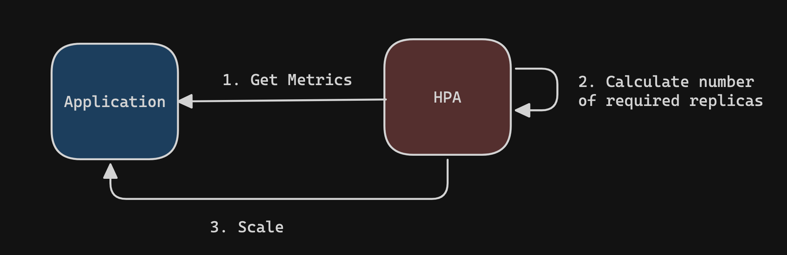
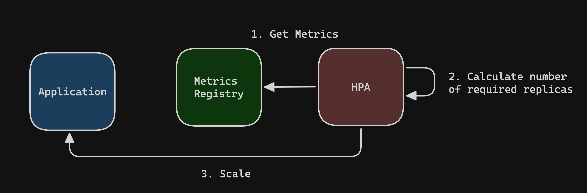
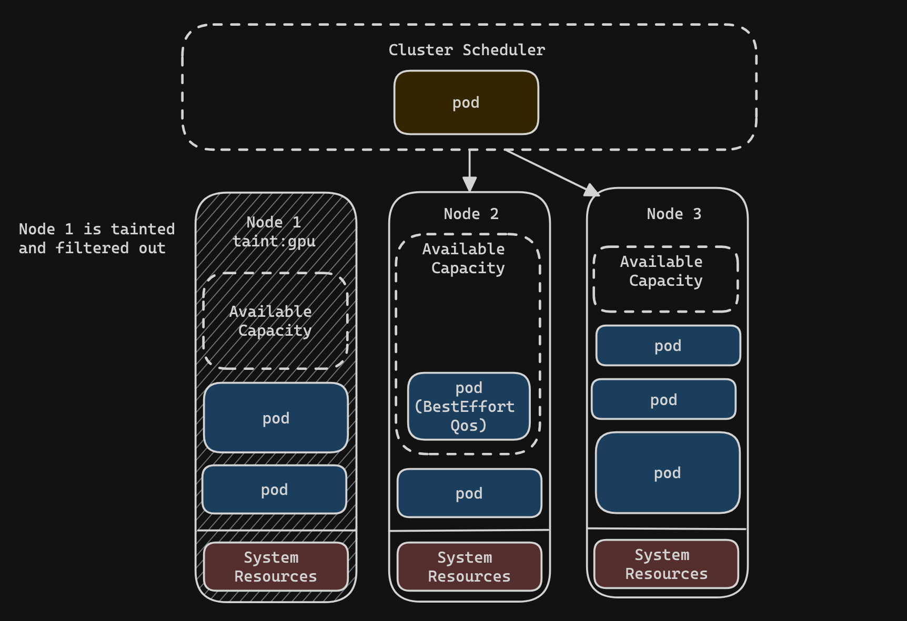

# Big Idea

Autoscaling is a key technology that builds on the elasticity of distributed cloud computing. To understand autoscaling in the Kubernetes environment, it will be important to understand the basic enabling technologies: containerization and distributed computing. By leveraging hese two technologies, Kubernetes supports horizontal pod autoscaling (hpa) and cluster autoscaling. In this post I will dive into some brief background on Containerization and distributed computing (just enough to be dangerous) and then take a more focused look at the horizontal autoscaling functionality of Kubernetes. 

# Containers and Distirbuted Computing

As I mentioned before, I want to touch briefly on the enabling technologies of autoscaling in the Kubernetes envrionment specifically. These two technologies are containers and distirbuted computation. Let's look at each in turn...

## Containers

Containers are often compared to VMs. They are both technologies that virtualize the resources of an underlying machine. Virtualization means that one homogenous resource is "virtually" represented as multiple resources. Unlike a VM which which virtualizes an entire machine including the hardware layers, a container on the other hand, virtualizes the execution environment (os, packages, libraries). Whereas the VM is equivalent to creating a habitable environment on Mars, a container is equivalent to putting on a space suit.  

What the container represents is a unit of deployment. It wraps an application so that it can be deployed and run predicatably on any machine without being concerned about the details of the underlying machine on which the container runs. One of these underlying details that a container is not concerned about is other containers running on the machine. This means that the container is an isolated execution environment consuming virtualized resources from an underlying physical machine


## Distributed Computing

Distributed computing is a natural product of the boom of networking technology that came out of the Bay area in the 80's and 90's. It was the end of the era of mainframe computing, in which time-sharing was a key mechnism for partitioning the computation of a single machine among many users by sharing processing time. With improving network capabilities and an increasingly available fleet of machine often with idle compute, companies tried to develop tools that presented a collection of machines as a single service. For many years this was stumbling breakthroughs with new technologies like remote procedure calls (RPC), network file systems (NFS), Andrew File System (AFS), Locus, Sprite, Plan 9, and on. 

The goal that many of these early systems tried to achieve was distributing an application acorss many machines. They attempted to present a single OS interface for many machines. In this paradigm, the process was the unit of distirbution.

Over more time than I care to write about here, the paradigm evolved. There was a shift away from trying to distribute processes across machine and towards distributing computation that was embarassingly parallel across machines.

> 📖 **Embarrassingly parallel tasks** are tasks that it takes relativlely little to no work to split the problem in parallel execution environments to run computation. If needed, results produced by tasks executed in parallel can be aggregated afterwards.

A perfect example for a computation unit to run in parallel across many machines is the modern container. Applications run across a fleet of machines and stateless HTTP requests can get handled by an application in any container or applications can consume from a central queue and process large numbers of jobs in parallel.

## Kubernetes

With a better understanding of containers and distributed computing it may be easier to step back and look at Kubernetes. Kubernetes, labelled as a container orechstraion system, is tool that presents a single interface (control plane) for users to run container-based applications across a large collection of nodes.

# Autoscaling

Cloud providers have a signifcant amount of computational resources at their disposal. As result, these providers, give user's a benefit known as elatisity. **Elastisity** is the ability to provision or de-allocated resources on demand and based on need. This is a unique feature of cloud environments that contrasts the often slow acquisition time and upfront captial that needs to beinvested to procure on-prem equipment.

Autoscaling is data-driven approach to provisioning and de-provisioning resources based on active load on a system at a given point in time. The two forms of autoscaling that we will look at further on are horizontal pod autocaling and cluster autoscaling. These are both forms of autoscaling in Kubernetes that would be descrbed as forms of horizontal scaling. **Horizontal scaling**, sometimes known as scaling out, refers to the addition of more discrete computation units (i.e. add more nodes or pods). In contrast, **vertical scaling**, also known as scaling up, means increasing the available hardware capabilites of the existing machines (add more cpu, memory).

## Horizontal Pod Autoscaling (HPA)

By default, any Kubernetes workload  you deploy that creates pods such as a deployment or statefulset is not going to autoscale. Usually in a basic configuration the number of desired pods will be statically set by defining the `replicas` field on the controller. However, the Kubernetes API supports a Horizontal Pod Autoscaler (HPA) resource. Rather than generating a fixed number of pods, the HPA will increase or decrease the number of pods for the workload (remember, horizontal scaling) based on the observed resource utilization of the pods in that workload.

More specifically, the horizontal pod autoscaler is a controller shipped as part of the Kubernetes controller manager, a daemon that embeds the default controllers shipped with Kubernetes. The HPA resources that we create via the Kubernetes API will specify configuration for this controller to manager our workloads.

When we talk about a controller in Kubernetes, we are talking about a control loop process that continuosuly evaluates the current state of the system, compares it to some desired state, and makes changes as required. In the case of the HPA, an metric is observed, compared to a threshold, and pods are scaled up or down (or not at all).



### Scaling Based on Resource Usage

In order to scale a pod based on observed resource usage you need to specify resource requests on a pod. Resources requests are a field that can be optionally defined as part of your pod template. The resource requests specify the amount of cpu and/or memory that the pod needs to run. Defining resource requests is considered best practice because they enable the Cluster Scheduler to determine whether there are any nodes with sufficient resources when placing a pod. 

Defining the resource requests for a pod is necessary for enabling HPA because the only resource metrics that the HPA can scale based on (without the more involved process of setting up custom pod or object metrics) are the observed usage of the requested cpu and memory resources. Here is an example HPA that scales based on the % utilization of CPU:

```yaml
apiVersion: autoscaling/v2
kind: HorizontalPodAutoscaler
metadata:
  name: nginx
spec:
  ## Defined the workload we want to scale
  scaleTargetRef:
    apiVersion: apps/v1
    kind: Deployment
    name: nginx
  minReplicas: 1
  maxReplicas: 10
  metrics:
  - type: Resource
    resource:
    name: cpu
    target:
        type: Utilization
        averageUtilization: 60
```

what you see above is an HPA that scales in a new pof for Deployment workload named nginx whenever the average cpu utilization is above 60%. An alternative to the `target.type: Utilization` is the `target.type: AverageValue`. Using the latter you can specify an exact value for resource usage, such as the number of milicores, or Gb of memory.

> 💡 **Important**: It is a common misperception when seeing a pod's % cpu usage or % memory usage to assume that the ratio is with respect to the resources available on the underlying node. In reality, more often that not this value is with respect to the resources requests specified on the pod spec. Further, the average utilization measured and compared to the threshold defined in the HPA is the resource usages of all the pods added and averaged. This means a situation can result where one pod's utilization is above the threshold but no new pods is scaled in since the average across all pods in the workload are below the threshold.


### The Autoscaling Algorithm

In the most basic scenario, scaling is triggered based on the ratio between the configured threshold metric value and the observed metric value. At any point in time you can calculate the number of replicas the autoscaler should have by using the same calulation:
```plaintext
desiredReplicas = ceil[currentReplicas * ( currentMetricValue / thresholdMetricValue )]
```
Based on the above calculation we know that a scale up occurs as soon as the thresholdMetricValue is surpassed. However, because we use ceil, a scale down does necessarily happen as soon as we drop below the threshold. This provides some stability to the scaling. Here is an example:
```plaintext
## Initial State
currentReplicas = 2
currentCPU = 100 #millicores
thresholdCPU = 100 

## No scale up
desiredReplicas = ceil(2 * (100 / 100)) = 2

## Scale Up
currentCPU = 101
desiredReplicas = ceil(2 * (101 / 100)) = ceil(2 * 1.01) = ceil(2.02) = 3 ## Now 3 replicas

## No Scale Down
currentReplicas = 3
currentCPU = 90
desiredReplicas = ceil(3 * (90 / 100)) = ceil(3 * 90) = ceil(2.7) = 3
```

### Scaling with Multiple Metrics

Scaling is not limited to one metric. You can specify multiple metric thresholds for scaling. When multiple metrics are defined, the HPA will evaluate each metric, select the metric that results in the gratest number of running pods, and scale if needed. If any metric cannot be calculated then scaling is skipped for that round of calulations.


### Scaling based on Custom Metrics

It's not unlikely that you may want to scale your workload based on metrics other than CPU or memory. To understand how to do this, let's deepen our understanding of how the horizontal pod autoscaler gathers metrics. 

Contrary to the original diagram provided above, there is actually third component involved in the control loop of the horizontal pod autoscaler. That component is the metrics registry. 

The metrics registry is an extension to the Kubernetes API that serves metrics through a standard interface to any clients in the cluster. Using Prometheus Metrics and the Prometheus Metrics Adapter, it is possible to expose custom metrics via the Metrics Server API for scaling purposes.




## Cluster Autoscaling

Scaling pods horizontally is great but its benefits are limited by the availability of the resources needed to actually run those pods. If your cluster consists of 5 nodes, then in all likely-hood, you can't support scaling up to tens or hundreds of a resource intensive pods for a resource intensive workload. There is where cluster autoscaling — the obverse of horizontal pod autoscaling — comes in to support a fully elastic workload. Cluster autoscaling is the ability have your cluster dynamically add or remove nodes from your cluster based on demand. In a cloud-based environment, vendors generally have a cluster autoscaling solution that integrates with their Virtual Machine solutions to automatically provision or de-provision nodes.

### Provisioning New Nodes

As I said above, cluster autoscaling is the ability have your cluster dynamically add or remove nodes from your cluster based on demand. However, we need to take a look at how *demand* is evaluated in the case of the cluster autoscaler. Unlike horizontal pod autoscaling, which scales the pods for a workload based on observed resource usage, the cluster autoscaler does not operate based on the observed resource usage of nodes. Instead the cluster autoscaler **operates based on the ability to schedule a new pod with the current available resources**.

When the cluster shceduler attemps to schedule a pod, it will look at the resource requests of that pod, filter out nodes from consideration based on any node taint/tolerations, and then check if any node has sufficient resources to host the pod. If there are no nodes with sufficient resources available to satisfy those requests, then the autoscaler will be triggered to add an aditional node.

#### Finding a Schedulable Node

Finding a scheduleable node is a two part process that consists of:
- **Filtering:** The Scheduler filters out nodes that the pod cannot be scheduled to based on node selectors, taints, and resources
- **Scoring:** The feasible nodes are passed through a series of scoring functions for determing which node should be used for placement 

For this post we'll focus on the resource filtering aspect of pod scheduling. 

After the scheduler filters out nodes based on taints and node selectors, the scheduler will compute the available capacity of each node. To calculate the available capacity of a node, you subtract the the resources allocated for the system (kubelet, OS processes) and the resources requests by currently running pods on that node. It is important to note that no real-time observed usage metrics are used for this process. If the node is determined to have available capacity for the requests of the pod then it is considered viable for scheduling and will be scored in the next phase.

The above description makes sense in a perfect world where requests are set on all of our workloads but that is not always the case. Given this fact, there are some nuances around pods without resource requests to understand.

Pods that do not have requests specified are considered to have a **BestEffort Quality of Service (QoS)**. The resource usage of pods with a BestEffort QoS running on a node are not considered as part of the calculation used by the scheduler to determine the available capacity of a node. However, if a node is under pressure for resources, BestEffort QoS pods are the first to be evicted from the node. If the scheduler is trying to schedule a pod with a BestEffort QoS, the pod will be placed on any node that has available capacity. While the scheduler does not look at metrics, the kubelet on each node does. If a node is under pressure for resource, the kubelet will begin to mark pods for eviction beginning with BestEffot QoS pods.

Let's take a look at an visual example of this:




We can observe a few key things here:
1. Node 1 is elimated due to having a taint that the new pod does not tolerate
2. The BestEffort QoS pod on node 2 does not decrease the computed available capacity of that node which can lead to over scheduling
3. Node 2 and Node 3 are feasible for scheduling the pod

But what happens if the pod couldn't be scheduled? In that case, the cluster autoscaler will be responsible for adding a new node into the cluster. If there is only one node type/size that can be scaled then scaling is trivial and a new node is provisioned. If there are multiple node pools available to this cluster with different types or sizes of node that could be added then the cluster autoscaler must select one of the available node pools to scale. How this selection is performed is the next topic that will be covered.

#### Expanders

If a pod cannot be scheduled and a new node must be provisioned for a cluster with multiple node pools then a decision needs to made about what type of node to add to the cluster. Often times you will have multiple node pools available in your cluster. These node pools could contain different sizes of node or nodes with differnet capabilities and hardware specifications. In this case, the question of how the Cluster Autoscaler selects which node pool to scale arises. This is the problem that expanders solve. **Expanders are strategies configured on the autoscaler profile that determine which node type to select when scaling up**.

> **Note:** If you only have one pool of node types available for scaling up then scaling in a new node is trivial and expanders do not apply.

Cluster Autoscaler implementations in the various cloud providers support a configuration for expanders. Expanders are strategies for solving this problem. Often there will be expanders for scaling based on the following:
- `price`: scale the node pool with the cheapest node type available.
- `priority`: scale node pools based on user assigned priority 
- `random`
- `least-waste`: Scales the node pool that would have the least idle CPU after all the pending pods are scheduled

For a full overview of expanders read up [here](https://github.com/kubernetes/autoscaler/blob/master/cluster-autoscaler/FAQ.md#what-are-expanders)

### De-provisioning Nodes


### CA Profile